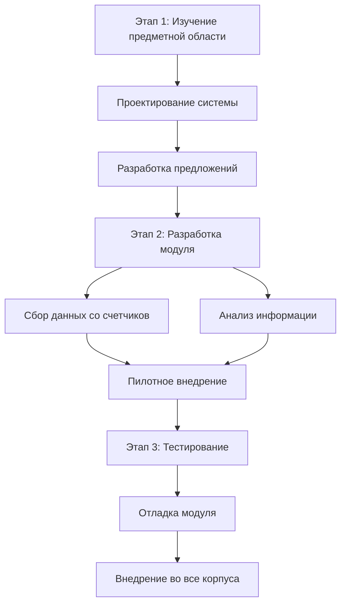

# Техническое задание на создание программного продукта "АРМ сотрудника ЖЭСа"

## 1. Общие положения

**Наименование системы**: Автоматизированное рабочее место сотрудника ЖЭСа  
**Назначение системы**: Автоматизация процессов сбора и анализа данных со счетчиков и устройств управления в жилых корпусах

## 2. Этапы реализации проекта

### Этап 1: Изучение предметной области и проектирование системы
- Проведение анализа бизнес-процессов ЖЭСа
- Исследование существующих систем учета коммунальных услуг
- Проектирование архитектуры системы
- Разработка технических предложений по реализации
- Согласование функциональных требований

### Этап 2: Разработка и пилотное внедрение
- Создание программного модуля сбора данных
- Разработка модуля анализа информации
- Интеграция с устройствами учета
- Пилотное внедрение в одном корпусе
- Обучение персонала

### Этап 3: Тестирование и полномасштабное внедрение
- Проведение комплексного тестирования системы
- Отладка и оптимизация работы модулей
- Внедрение системы во все корпуса
- Техническая поддержка и сопровождение

## 3. Схема реализации проекта

## 4. Функциональные требования

### Модуль сбора данных
- Поддержка различных типов счетчиков (электроэнергия, вода, газ)
- Автоматический сбор показаний
- Ручной ввод данных
- Валидация поступающей информации

### Модуль анализа информации
- Формирование отчетов
- Анализ потребления ресурсов
- Выявление аномалий в показаниях
- Визуализация данных

## 5. Технические требования

- Совместимость с ОС Windows 10/11
- Поддержка СУБД PostgreSQL
- Веб-интерфейс для удаленного доступа
- Резервное копирование данных
- Система авторизации и разграничения прав доступа

## 6. Критерии приемки

- Успешное тестирование всех функциональных модулей
- Отсутствие критических ошибок
- Соответствие производительности заданным параметрам
- Полное внедрение во всех корпусах
- Подтверждение работоспособности от пользователей
